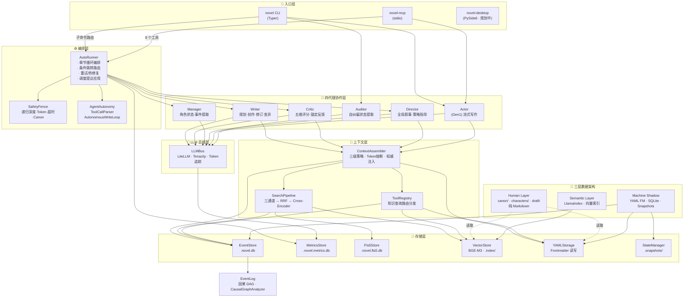
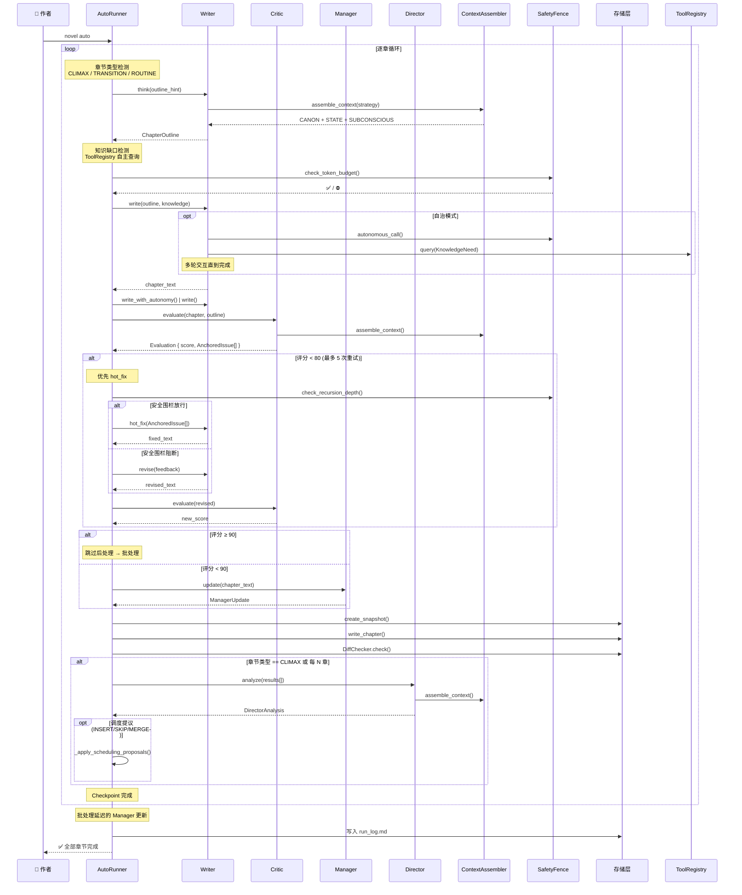
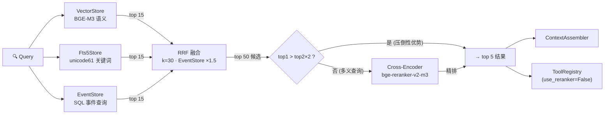
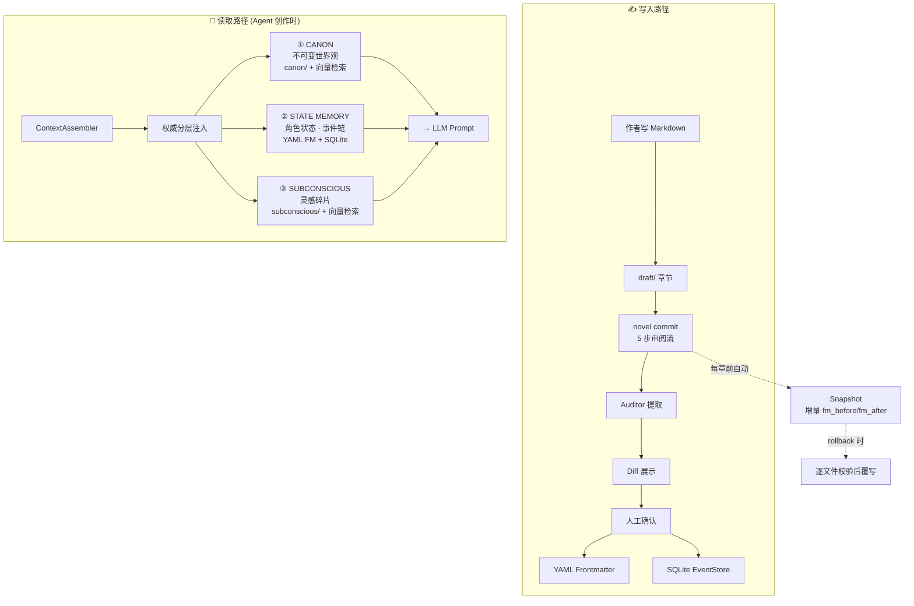
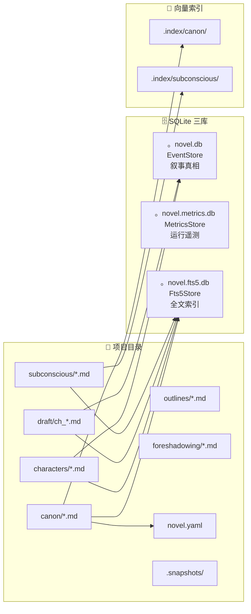

# OpenNovel 架构图

## 一、系统全景



## 二、四代理自主流水线（`novel auto`）



## 三、搜索管道（ADR 0007）



## 四、数据流与权威层级



## 五、存储矩阵



## 六、组件依赖关系

```mermaid
graph TB
    subgraph 对外接口
        CLI_Typer["CLI (Typer)"]
        MCP_Server["MCP Server"]
    end

    subgraph cli["opennovel/cli/"]
        cli_main["main.py"]
        cli_auto["auto.py"]
        cli_commit["commit.py"]
        cli_write["write.py"]
        cli_stash["stash.py"]
    end

    subgraph agents["opennovel/agents/"]
        ag_w["writer.py"]
        ag_c["critic.py"]
        ag_m["manager.py"]
        ag_d["director.py"]
        ag_a["actor.py"]
        ag_au["auditor.py"]
    end

    subgraph core["opennovel/core/"]
        co_ar["auto_runner.py"]
        co_ca["context_assembler.py"]
        co_llm["llm.py"]
        co_sf["safety_fence.py"]
        co_aa["agent_autonomy.py"]
        co_tr["tool_registry.py"]
        co_sp["search_pipeline.py"]
        co_ch["chunker.py"]
        co_rr["reranker.py"]
        co_sm["state_manager.py"]
        co_dc["diff_checker.py"]
        co_cc["canon_checker.py"]
        co_cg["causal_graph.py"]
        co_hr["hybrid_retriever.py"]
        co_re["retriever.py"]
        co_ms["mutation_strategy.py"]
        co_cu["chapter_utils.py"]
        co_pr["parser.py"]
        co_do["doctor.py"]
        co_ea["evaluation_auditor.py"]
        co_spj["state_projector.py"]
    end

    subgraph storage["opennovel/storage/"]
        st_sq["sqlite.py"]
        st_mt["metrics.py"]
        st_ft["fts5.py"]
        st_vc["vector.py"]
        st_ym["yaml_storage.py"]
        st_fs["foreshadowing.py"]
        st_tl["timeline.py"]
        st_su["summaries.py"]
    end

    subgraph schemas["opennovel/schemas/"]
        sc_ch["character.py"]
        sc_ev["event.py"]
        sc_ev2["evaluation.py"]
        sc_ol["outline.py"]
        sc_oe["outline_evaluation.py"]
        sc_di["director.py"]
        sc_mt["mutation.py"]
        sc_kn["knowledge.py"]
        sc_fs["foreshadowing.py"]
        sc_st["state.py"]
        sc_mu["manager_update.py"]
        sc_me["metrics.py"]
        sc_se["search.py"]
    end

    CLI_Typer --> cli_main
    MCP_Server --> co_ar
    MCP_Server --> ag_a

    cli_main --> cli_auto
    cli_main --> cli_commit
    cli_main --> cli_write
    cli_main --> cli_stash

    cli_auto --> co_ar
    cli_commit --> ag_au
    cli_write --> ag_a
    cli_stash --> co_re

    co_ar --> ag_w
    co_ar --> ag_c
    co_ar --> ag_m
    co_ar --> ag_d
    co_ar --> co_sf
    co_ar --> co_aa
    co_ar --> co_sm
    co_ar --> co_dc
    co_ar --> co_cu
    co_ar --> co_ms
    co_ar --> co_ea
    co_ar --> st_mt

    ag_w --> co_ca
    ag_w --> co_llm
    ag_w --> co_hr
    ag_w --> co_tr
    ag_w --> co_ms
    ag_c --> co_ca
    ag_c --> co_llm
    ag_c --> co_hr
    ag_d --> co_ca
    ag_d --> co_llm
    ag_a --> co_ca
    ag_a --> co_llm
    ag_m --> co_llm

    co_ca --> co_sp
    co_ca --> co_tr
    co_ca --> co_spj
    co_ca --> st_sq
    co_ca --> st_ym

    co_sp --> co_ch
    co_sp --> co_rr
    co_sp --> st_ft
    co_sp --> st_vc
    co_sp --> st_sq

    co_hr --> co_sp
    co_hr --> co_re
    co_hr --> st_sq

    co_tr --> co_re
    co_tr --> st_sq
    co_tr --> st_ym

    co_aa --> co_tr
    co_aa --> co_sf

    co_cg --> st_sq
    co_cc --> co_sf
    co_sm --> st_ym
    co_ea --> st_mt
    co_re --> st_vc
