# OpenNovel 优化实施路线图

> 基于 `opennoval改进意见.md`、`opennovel优化方向指导.md`、`code_review_results.md`
> 和 `rag_optimization_test_report.md` 的综合分析与实施方案。

## 架构决策记录索引

| ADR | 标题 | 状态 |
|-----|------|------|
| [0001](adr/0001-file-level-incremental-snapshots.md) | 文件级增量快照 | ✅ 已实现 |
| [0002](adr/0002-three-tier-context-strategy.md) | 三级上下文策略引擎 | ✅ 已实现 |
| [0003](adr/0003-unified-context-assembler-for-gen2-agents.md) | 统一 ContextAssembler 管道 | ✅ 已实现 |
| [0004](adr/0004-independent-metrics-database.md) | 独立指标数据库 | ✅ 已实现 |
| [0005](adr/0005-three-layer-mutation-control.md) | 三层变异控制 | ✅ 已实现 |
| [0006](adr/0006-hybrid-routing-architecture.md) | 混合动态路由架构 | ✅ 已实现 |
| [0007](adr/0007-hybrid-search-and-reranking-architecture.md) | 混合检索 + 重排序 | ✅ 已实现 |
| [0008](adr/0008-dynamic-context-engineering.md) | 动态上下文工程 | 📋 待实施 |
| [0009](adr/0009-advanced-retrieval-optimization.md) | 高级检索优化 | 📋 待实施 |
| [0010](adr/0010-multi-agent-architecture-enhancement.md) | 多代理架构增强 | 📋 待实施 |
| [0011](adr/0011-cost-efficiency-system.md) | 成本效率系统 | 📋 待实施 |
| [0012](adr/0012-real-time-self-healing-system.md) | 实时自愈体系 | 📋 待实施 |

## 分阶段实施计划

### Phase 1：成本效率（短期 · 1-2 月 · 预期 Token 节省 30-50%）

```
ADR 0011 (成本效率系统) + Code Review P1/P2 修复
```

| 任务 | 组件 | 工作量 | 优先级 |
|------|------|--------|--------|
| 弹性资源调度 | `core/priority_scheduler.py` | 中 | P0 |
| 内容感知模型路由 | `core/llm.py` 增强 | 中 | P0 |
| 延迟批处理扩展 | `core/lazy_batch.py` | 小 | P0 |
| 资源感知降级 | `core/resource_aware.py` | 中 | P1 |
| Prompt Cache 集成 | `core/llm.py` 增强 | 小 | P1 |
| 修复 P2-13 (.gitignore) | `.gitignore` | 极小 | P0 |
| 修复 P2-11 (_search_events LIMIT) | `core/search_pipeline.py` | 极小 | P0 |
| 修复 P2-12 (tool_registry 分数) | `core/tool_registry.py` | 小 | P1 |
| 修复 P2-14 (chunker FM 索引) | `core/chunker.py` | 中 | P1 |
| 修复 P1-6 (HybridRetriever fallback) | `core/hybrid_retriever.py` | 小 | P1 |
| 修复 P1-8 (rollback + FTS5) | `core/state_manager.py` | 中 | P1 |

**Phase 1 验收标准**：
- TRANSITION 章节 Token 消耗降低 ≥ 40%
- CLIMAX 章节自动升级到高性能模型
- 批处理 Metrics 写入合并为单事务
- `.novel.fts5.db` 加入 gitignore
- `novel rollback` 后 FTS5 索引保持一致

---

### Phase 2：检索增强 + 上下文工程（中期 · 3-4 月 · 预期检索精度提升 15-25%）

```
ADR 0009 (高级检索优化) + ADR 0008 (动态上下文工程)
```

| 任务 | 组件 | 工作量 | 优先级 |
|------|------|--------|--------|
| 动态置信度重排 | `core/reranker.py` 增强 | 小 | P0 |
| 语义缓存层 | `core/semantic_cache.py` | 中 | P0 |
| 查询转换模块 | `core/query_transformer.py` | 中 | P1 |
| 注意力预算管理器 | `core/attention_budget.py` | 大 | P0 |
| JIT 按需检索 | `core/jit_retriever.py` | 大 | P0 |
| 上下文一致性校验 | `core/context_validator.py` | 中 | P1 |
| 动态摘要触发 | `core/context_assembler.py` 增强 | 中 | P1 |
| 修复 P2-10 (向量检索按段落) | `core/search_pipeline.py` | 小 | P1 |

**Phase 2 验收标准**：
- 语义缓存命中率 ≥ 40%（连续章节场景）
- JIT 模式减少无关上下文 Token 注入 ≥ 30%
- 多义查询（如"剑"）触发 Cross-Encoder 重排
- 上下文一致性校验拦截 ≥ 95% 的 CANON 冲突
- 模糊查询通过 HyDE/Multi-Query 提升 Recall@5 ≥ 15%

---

### Phase 3：架构增强 + 自愈体系（长期 · 5-6 月 · 预期自动化率提升至 80%）

```
ADR 0010 (多代理架构增强) + ADR 0012 (实时自愈体系)
```

| 任务 | 组件 | 工作量 | 优先级 |
|------|------|--------|--------|
| 内部 LLM 混合 (Proposal-Synthesis) | `core/multi_model_orchestrator.py` | 大 | P1 |
| 多 Critic 投票 | `agents/critic.py` 增强 | 中 | P1 |
| 信用分配学习 | `core/credit_assignment.py` | 大 | P2 |
| 事件溯源调试 | `storage/metrics.py` + `agent_events` 表 | 中 | P1 |
| 在线守护进程 | `core/doctor.py` → `GuardianDaemon` | 大 | P0 |
| 分阶段评估体系 | `core/staged_evaluation.py` | 大 | P1 |
| 检查点恢复 | `core/auto_runner.py` 增强 | 中 | P1 |
| 故障分析报告 | `core/fault_analyzer.py` | 中 | P2 |
| 数据同步校验 | `core/cross_source_validator.py` | 中 | P1 |
| A/B 对照实验框架 | `core/staged_evaluation.py` | 中 | P2 |

**Phase 3 验收标准**：
- GuardianDaemon 自动检测并修复 ≥ 70% 的轻度一致性问题
- 多 Critic 投票使 CLIMAX 章节评分方差降低 ≥ 40%
- 检查点恢复成功从 LLM 超时中断中恢复 ≥ 90%
- 事件溯源可回溯任意章节的完整 Agent 决策链
- 信用分配可识别 Top 3 影响评分的 Agent 环节

---

## 模块依赖图

```mermaid
graph TB
    subgraph Phase1["Phase 1: 成本效率"]
        PS["priority_scheduler"]
        CAR["llm.py 增强<br/>ContentAwareRouter"]
        LB["lazy_batch"]
        RA["resource_aware"]
        Fixes1["Code Review P1/P2 修复"]
    end

    subgraph Phase2["Phase 2: 检索 + 上下文"]
        AB["attention_budget"]
        JIT["jit_retriever"]
        CV["context_validator"]
        QT["query_transformer"]
        SC["semantic_cache"]
        DR["reranker.py 增强<br/>动态重排"]
    end

    subgraph Phase3["Phase 3: 架构 + 自愈"]
        MMO["multi_model_orchestrator"]
        CA2["credit_assignment"]
        GD["GuardianDaemon"]
        SE["staged_evaluation"]
        CK["CheckpointManager"]
        FA["fault_analyzer"]
        CSV["cross_source_validator"]
    end

    subgraph Foundation["已有基础"]
        AR7["ADR 0007<br/>SearchPipeline"]
        AR6["ADR 0006<br/>Agent Autonomy"]
        AR4["ADR 0004<br/>MetricsStore"]
        AR2["ADR 0002<br/>ContextStrategy"]
        AR1["ADR 0001<br/>Snapshots"]
    end

    PS --> AR6
    CAR --> AR4
    LB --> AR6
    RA --> AR7
    RA --> AR2

    AB --> AR2
    JIT --> AR7
    JIT --> AR6
    CV --> AR7
    QT --> AR7
    SC --> AR7
    DR --> AR7

    MMO --> AR6
    CA2 --> AR4
    GD --> AR1
    GD --> AR4
    SE --> AR7
    CK --> AR1
    FA --> AR4
    CSV --> CV
```



## 新增 CLI 命令

| 命令 | ADR | 说明 |
|------|-----|------|
| `novel guardian start` | 0012 | 启动在线守护模式 |
| `novel doctor --optimize` | 0010 | 显示信用分配优化建议 |
| `novel doctor --trace <id>` | 0010 | 回放事件溯源链 |
| `novel doctor --abtest <dim>` | 0012 | 运行 A/B 对照实验 |
| `novel doctor --diagnose-failure <ch>` | 0012 | 查看故障分析报告 |
| `novel reindex --auto` | 0011 | 自动检测并增量重建 |

## 风险与缓解

| 风险 | 概率 | 影响 | 缓解措施 |
|------|------|------|---------|
| 多模型模式 Token 成本失控 | 中 | 高 | 仅在作者显式配置时启用，默认关闭；CLIMAX 章节单独预算帽 |
| JIT 模式引入额外延迟 | 中 | 中 | 语义缓存 + 同次会话内结果复用；ToolRegistry 查询走非重排快路径 |
| GuardianDaemon 自动修复误判 | 低 | 高 | CANON 冲突修复必须人工确认；仅轻度一致性问题自动修复 |
| Cross-Encoder 模型下载失败 | 中 | 低 | 已有 graceful degradation（回退 RRF）；资源感知降级自动跳过 |
| 检查点数据膨胀 | 低 | 低 | 每章完成后清除检查点；最多保留 3 个检查点 |

## 预期总体收益

| 维度 | 当前 | 目标（6 个月后） |
|------|------|-----------------|
| Token 消耗/千字 | 基准 | -30~50% |
| 检索精确命中率 | 97% | ≥ 98% |
| CLIMAX 章节评分方差 | 未测量 | -40% |
| 轻度一致性问题自动修复率 | 0% | ≥ 70% |
| LLM 超时中断恢复率 | 0%（手动） | ≥ 90%（自动） |
| 重试收敛率 | 未测量 | ≥ 85% |
| 新用户上手时间 | 约 2 小时 | ≤ 30 分钟（含教程向导） |
